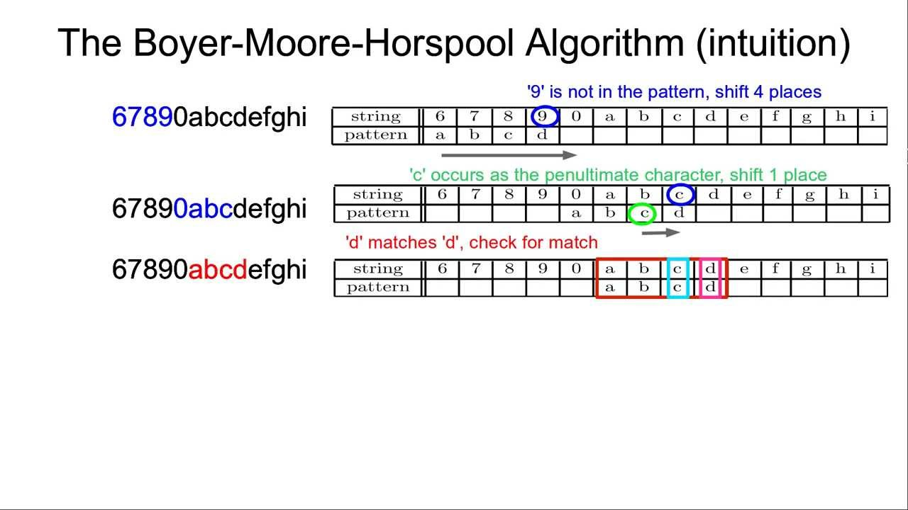
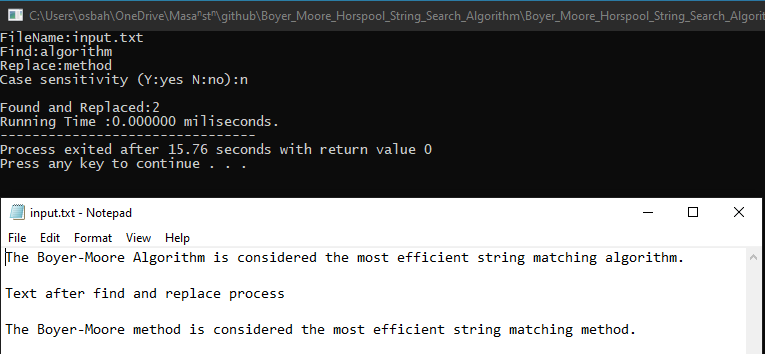
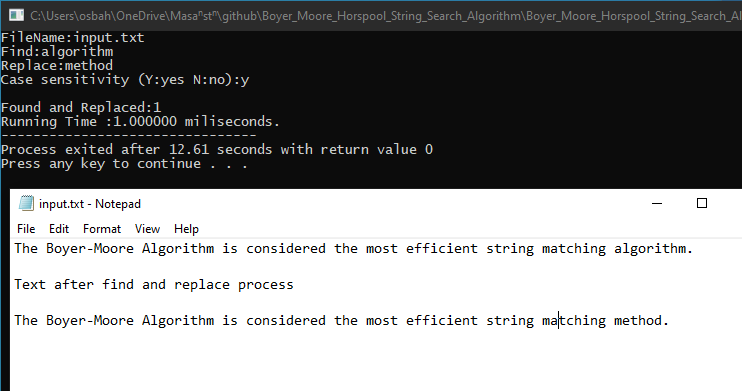

# Boyer Moore Horspool String Search Algorithm in C

## What is Boyer Moore Horspool Algorithm

In computer science, the Boyer–Moore–Horspool algorithm or Horspool's algorithm is an algorithm for finding substrings in strings. It was published by Nigel Horspool in 1980 as SBM.

It is a simplification of the Boyer–Moore string search algorithm which is related to the Knuth–Morris–Pratt algorithm. The algorithm trades space for time in order to obtain an average-case complexity of O(n) on random text, although it has O(nm) in the worst case, where the length of the pattern is m and the length of the search string is n.

## Used Technologies

I used the C programming language in this project because it is a low-level language, and it is a challenge for me.

## How the program works

- The program scans given txt file, finds the given pattern in the text and replaces it with the given pattern.

## Screenshots

